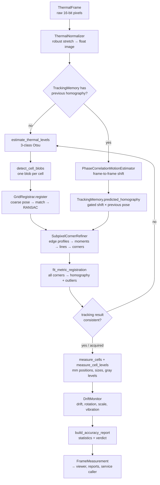

# System guide

A deep walkthrough of the system: what every part does, the algorithms behind it with their
derivations, a reference for every file and function, and what each test proves.

Read it in order the first time. Section 2 gives the big picture, section 3 explains the
algorithms, sections 4–6 are reference material you can come back to.

---

## Contents

1. [The problem in one page](#1-the-problem-in-one-page)
2. [The big picture](#2-the-big-picture)
3. [Algorithms in depth](#3-algorithms-in-depth)
4. [Module reference](#4-module-reference)
5. [Test reference](#5-test-reference)
6. [Project files and tooling](#6-project-files-and-tooling)
7. [Glossary](#7-glossary)

---

## 1. The problem in one page

A flat board carries a grid of square cells. Each cell is heated or cooled so it is clearly
hotter or colder than the board surface (the *substrate*) between cells. A thermal camera looks
at the board. For every frame the system must:

1. find the board and identify every cell;
2. find each cell's four corners in the image, far more precisely than one pixel;
3. convert those corners into physical board coordinates (millimetres);
4. compare them with the design and report deviations, sizes and measured gray levels;
5. keep doing this in real time while the board vibrates, drifts or expands.

Everything is classical computer vision and geometry. There is no trained model. Every number
can be traced to an explicit formula.

Three ideas carry the whole design:

- **Two coordinate systems linked by one homography.** The board is a plane, so a single 3 × 3
  matrix maps board millimetres to image pixels. Estimating that matrix well is the core of
  localization. Inverting it turns image measurements into millimetres.
- **Many weak measurements give one strong one.** One edge profile is noisy. Six profiles per
  edge, four edges per cell and thousands of cells, combined through least-squares fits, give
  sub-pixel accuracy.
- **Detect once, then track.** The expensive, robust search runs only on the first frame or
  after the board is lost. Later frames start from the previous answer.

---

## 2. The big picture

### 2.1 Per-frame data flow



The orchestration lives in `BoardMeasurementPipeline.process`
(`pipeline/board_measurement_pipeline.py`):

```text
process(frame)
 ├─ normalize(frame.pixels)                          → image
 ├─ localize_or_raise(image)                         → BoardLocalization
 │    └─ localize(image)
 │         ├─ shift = motion_estimator.estimate(image)
 │         ├─ track(image, previous, shift)          (if a previous pose exists)
 │         │    ├─ prior = memory.predicted_homography(shift, limit)
 │         │    ├─ complete(image, TRACKING, prior)  → refine + metric fit
 │         │    └─ is_consistent_track(...)          → accept or None
 │         └─ acquire(image)                         (if tracking was not possible or failed)
 │              ├─ detect_blobs(image)
 │              ├─ registrar.register(blobs)
 │              └─ complete(image, ACQUISITION, registration.homography)
 ├─ measure(metric, frame.pixels)                    → CellMeasurements
 └─ report(frame, localization, cells, started)      → AccuracyReport
```

### 2.2 Coordinate systems

| System | Units | Origin and axes | Where it appears |
|---|---|---|---|
| Board | mm | top-left corner of the board; x right, y down | `BoardModel`, metrology, reports |
| Undistorted image | px | as if the lens had no distortion | homographies, blob centroids |
| Raw image | px | the camera image; pixel centres at integer coordinates | sampling, overlays |

- **Homography `H`.** Maps board mm → undistorted image px. `project_points(H, p)` applies it,
  and `project_points(inv(H), q)` goes back.
- **Lens model.** `PinholeCameraModel.distort` / `undistort` convert between undistorted and raw
  pixels. With zero distortion coefficients both are the identity.
- **Pixel-centre convention.** Pixel `(u, v)` represents the area `[u−½, u+½] × [v−½, v+½]`.
  OpenCV sampling, the simulator and ground truth all use this convention, which is why the
  sub-pixel results are unbiased.

### 2.3 Cell identity

A cell has three equivalent identities:

- **Cell number `n`** (`0 … N−1`): the public identity. Every per-cell array is indexed by `n`.
- **Grid position `(row, column)`:** row 0 is the top row and column 0 the leftmost column, as
  seen by the camera.
- **Polarity:** hot or cold in the default checkerboard, `hot ⇔ (row + column) even`.

`BoardModel.cell_rows_and_columns[n]` gives the grid position of cell `n`, and
`BoardModel.cell_number_grid[row, column]` gives the number. The numbering order comes from
configuration; the default is right to left within a row, rows top to bottom.

### 2.4 The main data records

| Record | Defined in | Holds |
|---|---|---|
| `SystemConfiguration` | `config/system_settings.py` | every setting, grouped in typed sections |
| `ThermalFrame` | `acquisition/thermal_frame.py` | index, timestamp, raw pixels |
| `CellBlobs` | `detection/cell_blob_detector.py` | blob centroids, polarity, areas |
| `GridRegistration` | `detection/grid_registration.py` | coarse homography, matches, match ratio, pitch |
| `RefinedCorners` | `refinement/subpixel_corner_refiner.py` | `(N, 4, 2)` corners in px, edge-fit RMS, validity |
| `MetricRegistration` | `measurement/cell_metrology.py` | final homography, image corners, validity |
| `CellMeasurements` | `measurement/cell_metrology.py` | per-cell corners/centres in mm, sizes, deviations, gray levels |
| `AccuracyReport` | `measurement/accuracy_report.py` | statistics, drift, latency, verdict |
| `BoardLocalization` | `pipeline/board_measurement_pipeline.py` | mode, prior pose, refined corners, metric registration |
| `FrameMeasurement` | `pipeline/board_measurement_pipeline.py` | everything above for one frame |

All records are immutable dataclasses. Arrays use NumPy; inside the refinement stage they may
be CuPy arrays on the GPU.

### 2.5 Package map

```text
config/        what the system is told       (settings, loading, validation)
acquisition/   where frames come from         (files, videos, factory)
simulation/    synthetic frames + truth        (renderer, sequences, level tables)
preprocessing/ making frames comparable        (normalization)
detection/     finding and naming cells        (levels, blobs, registration)
refinement/    sub-pixel corners               (profiles, edge estimator, lines)
geometry/      shared mathematics              (board layout, homography, camera, pose)
measurement/   turning geometry into results   (metrology, radiometry, statistics)
tracking/      frame-to-frame behaviour        (motion, drift, smoothing)
compute/       CPU/GPU abstraction             (array backends, samplers)
pipeline/      orchestration                   (the per-frame algorithm, wiring)
reporting/     text and JSON output
viewer/        visual output                   (overlay, level map, windows, session loop)
service.py     UI-independent API for other applications
cli.py         command-line entry point
```

Dependencies point downward: `geometry` and `config` depend on nothing else in the project,
`pipeline` depends on the algorithm packages, and `viewer`, `service` and `cli` sit on top.

---

## 3. Algorithms in depth

### 3.1 Radiometric normalization

*Code: `preprocessing/thermal_normalizer.py`*

Raw LWIR counts depend on scene temperature, camera gain and offset. To make the thresholds
and contrasts below meaningful, each frame is rescaled:

```text
low, high  = percentile(pixels, 0.5 %), percentile(pixels, 99.5 %)   on a 4×-subsampled copy
normalized = (pixels − low) / (high − low)
```

- **Percentiles, not min/max.** A few dead or hot pixels must not decide the scale.
- **No clipping.** Values above the 99.5 % percentile stay above 1.0. Clipping would flatten a
  cell that is hotter than the rest and bias its edges (this was a real bug, now covered by a
  test). Display code clips separately.
- **Optional Gaussian denoising.** Disabled by default because the edge estimator already
  averages noise.

### 3.2 Three thermal levels (three-class Otsu)

*Code: `detection/thermal_level_estimation.py`*

The image contains three populations: cold cells, substrate (and background), and hot cells.
Otsu's method finds thresholds that best separate populations by maximizing the
**between-class variance**.

For a normalized histogram with bin probabilities `p_i` and bin centres `x_i`, choose
thresholds `t₁ < t₂` splitting the bins into classes `C₁ = [0, t₁)`, `C₂ = [t₁, t₂)`,
`C₃ = [t₂, B)`. With class weight `ω_k = Σ p_i` and class moment `μ_k = Σ p_i x_i`, the
between-class variance is, up to a constant,

```text
σ_B²(t₁, t₂) = Σ_k μ_k² / ω_k
```

Cumulative sums turn every `ω_k` and `μ_k` into a subtraction of two prefix values
(`cumulative_moments`). Every pair `(t₁, t₂)` of the 128 bins is evaluated at once
(`np.triu_indices`), which is exhaustive, exact and deterministic. The class means
`μ_k / ω_k` become the cold, substrate and hot levels, and blob thresholds sit halfway between
neighbouring levels (`ThermalLevels.hot_threshold`, `cold_threshold`).

### 3.3 Cell blobs

*Code: `detection/cell_blob_detector.py`*

1. Threshold twice: `image > hot_threshold` and `image < cold_threshold`.
2. Label connected regions (4-connectivity, `cv2.connectedComponentsWithStats`). Each region's
   centroid and area come for free.
3. Filter by area, separately for each polarity. Take the median area of regions with at least
   4 px, then keep regions between 0.4× and 2.5× that median. Noise specks and large
   background objects disappear.

A blob centroid is accurate to a few tenths of a pixel. That is not the final precision, but
thousands of centroids together give an excellent first homography.

### 3.4 Registration: which blob is which cell

*Code: `detection/grid_registration.py`*

**Coarse pose.** For a roughly upright board, the four corner cells are the blobs that extremize
`x + y` (top-left minimum, bottom-right maximum) and `x − y` (top-right maximum, bottom-left
minimum). Their centroids and the nominal centres of the four corner cells give four
correspondences, exactly enough for a homography (`coarse_board_homography`).

**Matching** (`match_cells_to_blobs`):

1. Project every cell's nominal centre through the current homography.
2. Find the nearest blob with a KD-tree, accepting it only within
   `tolerance = 0.35 × pitch_px` (`GridRegistrar.tolerance`). The pitch in pixels comes from
   the homography's local Jacobian (`estimate_pitch_px`). The tolerance is below half a pitch,
   so a blob cannot be within reach of two cells.
3. **Polarity check.** A hot blob may only match a cell expected to be hot. A pose wrong by one
   cell flips every polarity, so this check rejects whole wrong solutions. It can be switched
   off for non-checkerboard patterns.
4. If two cells claim the same blob, the closer one wins (`keep_unique_blob_assignments`).

**Robust fit.** RANSAC repeatedly fits homographies to random four-point subsets, keeps the
largest consensus set (residual ≤ 1.5 px), and refines on all inliers with Levenberg–Marquardt
(`cv2.findHomography`). Matching and fitting alternate twice (`GridRegistrar.refine`). Each round
starts from a better pose, so more cells match. If fewer than 60 % of cells match, registration
fails with `GridRegistrationError`.

### 3.5 Homographies

*Code: `geometry/planar_homography.py`*

A homography maps a plane to an image with a 3 × 3 matrix in homogeneous coordinates:

```text
[x' y' w']ᵀ = H [X Y 1]ᵀ,     image point = (x'/w', y'/w')
```

It has 8 degrees of freedom: scale is arbitrary, so the matrix is normalized with `H[2,2] = 1`.
It captures rotation, translation, scale, tilt and perspective of a plane seen by a pinhole
camera.

- **`project_points`** applies it to arrays of any leading shape.
- **`local_jacobian`** gives the 2 × 2 derivative at a point by finite differences. Its columns
  are how many pixels one millimetre in x or y covers there.
- **`pixels_per_millimetre`** is the square root of the absolute Jacobian determinant: the local
  linear scale.

### 3.6 Sub-pixel corners: the precision core

*Code: `refinement/` (`edge_profile_sampling.py`, `edge_moment_locator.py`, `line_fitting.py`,
`subpixel_corner_refiner.py`)*

Starting point: a predicted position for every cell corner (from the homography). Goal: the
true corners, to a few hundredths of a pixel.

#### 3.6.1 Profile layout

Each cell has 4 edges, edge `i` running from corner `i` to corner `i+1`. Corners are ordered
top-left, top-right, bottom-right, bottom-left. For every edge:

- **Anchors:** `K` points along the edge at fractions `linspace(m, 1−m, K)` (`m` = 0.18,
  `K` = 6), kept away from the rounded corners.
- **Normal:** the unit vector perpendicular to the edge, `(−dy, dx)/|d|`.
- **Profile:** for each anchor, samples along the normal at offsets `−H … +H` in steps of
  0.25 px, where `H = W + capture margin`.

`W` is the moment window half-width. It is chosen so the window never reaches the next cell's
edge across the gap (`search_half_width_px`):

```text
W = 0.8 × (narrowest of gap, cell width, cell height in mm) × pixels_per_mm / 2
```

The samples are arranged **sample-major**, shape `(L, N, 4, K)`, so the image sampler writes
them contiguously and every later reduction runs across thousands of profiles at once.

#### 3.6.2 The moment edge estimator

Sampling the image bilinearly turns each profile into a piecewise-linear curve. A naive "peak
of the gradient" detector snaps to pixel segments (±0.5 px error). Instead, the system uses an
**area (first-moment) estimator**.

Normalize a profile so it runs from 0 at the window start to 1 at the window end:
`F(s) = (p(s) − p(s₀)) / (p(s₁) − p(s₀))`. An ideal step at position `e` inside `[s₀, s₁]` has
area `∫ F = s₁ − e`. So:

```text
e = s₁ − ∫_{s₀}^{s₁} F(s) ds
```

The integral is computed with the trapezoidal rule. Two properties make it ideal here:

- **Blur-independent.** For any point-spread function symmetric about the edge, the area is
  unchanged, so the estimate is unbiased.
- **Pixel-phase independent.** Integration averages over the piecewise-linear interpolation.

**The truncation problem.** The window is short; it has to stay out of the neighbouring cell. A
blurred edge (Gaussian width `σ`) that is not centred in a window of half-width `W` is pulled
toward the window centre. Linearizing around the centre gives a **gain**:

```text
g = d(estimate)/d(true offset) = 1 − 2 (W/σ) φ(W/σ) / (2 Φ(W/σ) − 1)
```

Here `φ` and `Φ` are the standard normal density and distribution. With `W/σ ≈ 1.9` this gives
`g ≈ 0.71`: a 0.6 px offset reads as about 0.43 px.

**The fix: self-centring windows** (`recentre_windows`). Sample each profile once, a little
longer than the window (the capture margin), and then repeat in 1-D:

```text
centre₀ = 0
centreₖ₊₁ = moment estimate using the window [centreₖ − W, centreₖ + W]
```

Each step removes about 70 % of the remaining error (the factor is `1 − g`). At the fixed point
the window is symmetric about the edge, where the estimator is exact. Five iterations leave
under 1 % residual. All of it happens on already-sampled data, which is cheap.

The windowed moment is computed in O(1) per profile:

- **Cumulative trapezoid** (`cumulative_trapezoid`) gives the integral from the profile start
  to any sample.
- **`SampledProfiles.interpolate`** returns the value and the exact integral at any fractional
  position.
- **`windowed_moment`** combines the two window ends:

```text
e = c + W − (A(c+W) − A(c−W) − p(c−W)·2W) / (p(c+W) − p(c−W))
```

Each profile also reports its **step contrast** `|p(c+W) − p(c−W)|`. Profiles with contrast
below `minimum_edge_contrast` (0.08), or whose edge left the sampled range, get zero weight.

#### 3.6.3 Lines from edge points

Every profile gives one edge point: `anchor + offset × normal`. Each edge's `K` points are
fitted with a **weighted total-least-squares line** (`fit_lines`). This minimizes perpendicular
distances, not vertical ones, which is the right model for a line in an image.

For weighted means `(x̄, ȳ)` and second moments `xx, xy, yy` of the centred points, the line
direction is the major axis of the 2 × 2 covariance. In closed form (`minor_axis`):

```text
θ      = ½ atan2(2·xy, xx − yy)               major-axis angle
n      = (−sin θ, cos θ)                      line normal
λ_min  = (xx+yy)/2 − √(((xx−yy)/2)² + xy²)    smallest eigenvalue
line:  n·p + c = 0,   c = −n·(x̄, ȳ)
residual RMS = √λ_min
```

The closed form replaces a batched eigen-solver, which is many times faster for 2 × 2 matrices.

#### 3.6.4 Corners from lines

In homogeneous coordinates, the intersection of lines `l₁ = (a₁, b₁, c₁)` and `l₂` is the cross
product `l₁ × l₂`. Corner `i` lies on edges `i−1` and `i`, so
`corner_i = cross(line_{i−1}, line_i)`, then divide by the third component
(`intersect_consecutive_lines`). Every corner uses evidence from two full edges, not just the
pixels around it.

#### 3.6.5 Validity gates

A cell is valid only if (`SubpixelCornerRefiner.validity`):

- every edge has at least 2 usable profiles;
- every edge-fit RMS is at most `maximum_edge_rms_px` (0.5 px), so the edges are straight;
- no corner moved more than `maximum_corner_shift_px` (1.5 px) from its prediction.

Invalid cells are excluded from fits and statistics and drawn grey; they are never reported as
measurements.

### 3.7 From corners to millimetres

*Code: `measurement/cell_metrology.py`*

**Metric registration** (`fit_metric_registration`):

1. Fit one homography from the nominal corners of all valid cells (mm) to their refined image
   corners (px), using RANSAC with a 0.5 px threshold and Levenberg–Marquardt on the inliers.
2. Any cell with an outlier corner becomes invalid.

This homography uses about four times as many points as registration, each about ten times
more precise, so it is the system's best estimate of the board pose.

**Back-projection.** `MetricRegistration.board_corners_mm` applies `H⁻¹` to the image corners:
the measured corners in board millimetres.

**Metrology** (`measure_cells`):

```text
centre_n            = mean of the 4 measured corners
centre_deviation_n  = centre_n − nominal centre_n                 (x, y) in mm
corner_deviation_nk = |measured corner_nk − nominal corner_nk|    in mm
width_n             = mean(|top edge|, |bottom edge|)
height_n            = mean(|left edge|, |right edge|)
```

**Why deviations are meaningful.** A homography can absorb a uniform change of the whole board
(translation, rotation, uniform scale, perspective), but not local deformations. A single
displaced cell therefore shows up as a deviation. Uniform expansion is absorbed (see 3.10).

### 3.8 Cell gray levels

*Code: `measurement/cell_radiometry.py`*

For each cell, 9 interior points at fractions 0.3 / 0.5 / 0.7 in x and y (the central region,
away from blurred edges) are projected through `H`, distorted to raw pixels, sampled bilinearly
in the **raw** frame, and averaged. Raw counts are used, not normalized values, so the result is
in the camera's radiometric units and comparable across frames. The result is
`CellMeasurements.measured_levels[n]`.

### 3.9 Tracking

*Code: `tracking/phase_correlation_motion.py`, `pipeline/board_measurement_pipeline.py`*

**Phase correlation.** For two images related by a shift, the normalized cross-power spectrum
is a pure phase ramp, and its inverse Fourier transform is a peak at the shift. The frames are
downsampled 2× with area averaging and weighted by a Hanning window to suppress border effects.
The result is in full-resolution pixels.

**The periodic-target trap.** A checkerboard looks the same after shifting by two pitches,
which also preserves polarity. Phase correlation can lock onto such an alias. Validation once
caught a lock two rows off. Two guards prevent it:

1. **Gating** (`TrackingMemory.predicted_homography`): a predicted shift larger than
   `maximum_frame_shift_pitch_ratio × pitch` (0.4) is ignored, and the previous pose is used
   unchanged.
2. **Consistency** (`is_consistent_track`): the tracked solution must have enough valid cells,
   and the board centre must not have moved more than the same limit. Otherwise the result is
   discarded and the board is re-acquired from scratch.

**Prediction.** `prior = T(shift) · H_previous`, where `T` is a pure translation. The sub-pixel
stage then corrects whatever the prediction missed; the capture margin and re-centring absorb
errors up to about 1 px.

### 3.10 Drift, rotation, scale and vibration

*Code: `tracking/drift_monitor.py`*

For each frame the monitor records the board centre's image position and the local Jacobian
`J` of `H` there. Against the first frame (reference):

```text
translation = centre_now − centre_ref                         pixels
A           = J_now · J_ref⁻¹                                 relative 2×2 change
rotation    = atan2(A₁₀ − A₀₁, A₀₀ + A₁₁)                     degrees
scale_ppm   = (√|det A| − 1) × 10⁶
vibration   = RMS of the last N frame-to-frame centre motions
```

**Apparent scale.** From a single plane, a uniformly larger board and a closer board produce
the same image. `scale_ppm` therefore reports *apparent* expansion relative to the first frame.
Separating true expansion needs an independent reference.

**Smoothing** (`tracking/corner_smoothing.py`). Optional exponential smoothing of measured mm
corners: `state ← α·new + (1−α)·state`, updated only for valid cells. `α = 1` disables it.
Smoothing in board millimetres means rigid motion of the board does not blur the result.

### 3.11 Statistics and verdict

*Code: `measurement/accuracy_report.py`*

| Quantity | Definition |
|---|---|
| corner position | mean / RMS / max of all valid corner deviations (mm) |
| centre position | statistics of centre deviation magnitudes |
| width / height error | statistics of `measured − nominal` size |
| reprojection RMS | RMS image distance between projected nominal corners and refined corners (px) |
| edge-fit RMS | median over valid cells of the per-cell edge residual (px) |
| mm per pixel | board span between the first and last cell corners ÷ its image span |
| out of tolerance | valid cells whose worst corner exceeds `tolerance_mm` |

**Verdict** (`precision_target_met`). `PASS` requires all three: corner RMS ≤
`target_precision_mm`, worst corner ≤ `tolerance_mm`, and no cell out of tolerance.

### 3.12 The simulator

*Code: `simulation/`*

Validation needs images with **exact** ground truth, which the simulator produces.

**Radiance model** (`CheckerboardRadianceField`). Blurring a rectangle `[a, b]` with a Gaussian of
width `σ` gives, along one axis,

```text
coverage(v) = ½ [ erf((v − a)/(√2 σ)) − erf((v − b)/(√2 σ)) ]
```

A rectangular cell is separable: coverage = coverage_x × coverage_y. For each sample point the
renderer:

1. finds the nearest cell (`nearest_cell_numbers`);
2. computes its blurred coverage, using that cell's level and optional displacement from a
   `CellPattern`, both indexed by cell number;
3. composes the result:

```text
board_level = substrate + (cell_level − substrate) × cell_coverage
radiance    = background + (board_level − background) × board_coverage
```

The blur `σ` is set in pixels and converted to millimetres through the ground sample distance.

**Imaging** (`ThermalBoardRenderer`):

1. Every pixel is supersampled (`s × s` sub-positions centred in the pixel).
2. Each sub-position is mapped through `H⁻¹` to the board, and its radiance is evaluated.
3. The samples are averaged, which models pixel area integration.
4. Gaussian sensor noise is added, and the result is rounded and clipped to the camera's bit
   depth.

**Why analytic.** An earlier version rendered sharp edges and relied on supersampling for
anti-aliasing. That quantized edge positions to 1/s px, and the simulator itself became the
largest error in the chain. The analytic blurred field is exact to floating-point precision.

**Pose** (`geometry/board_pose.py`):

```text
H = K · [r₁ r₂ t] · C
```

- `K` is the intrinsic matrix.
- `r₁` and `r₂` are the first two columns of the rotation, `R = R_roll · R_yaw · R_pitch`.
- `t` places the board at the working distance.
- `C` moves the board centre to the origin and applies an optional uniform scale (expansion).

**Sequences** (`SyntheticSequenceSource`). Frame `i` uses
`T(drift·i + vibration_i) · H(scale = 1 + ppm·i·10⁻⁶)`, with uniform random vibration. The exact
`H` of every frame is available as ground truth.

### 3.13 Compute backends and performance

*Code: `compute/array_backend.py`*

The refinement stage is written against an array module `xp`: NumPy on the CPU, CuPy on the
GPU. Only image sampling differs:

- **CPU:** `cv2.remap` with bilinear interpolation. Coordinates are tiled into rows of 1024
  because OpenCV limits map dimensions (`tile_for_remap`).
- **GPU:** `cupyx.scipy.ndimage.map_coordinates` with `order=1`.

`select_compute_backend` tries the GPU when configured and falls back to the CPU.

Performance choices visible in the code:

- the sample-major profile layout (contiguous memory, no transposes);
- closed-form 2 × 2 line fits instead of batched eigen-solvers;
- O(1) windowed moments from cumulative integrals;
- skipping blob detection and registration while tracking.

---

## 4. Module reference

Every module, class and function, grouped by package. Signatures are abbreviated; see the
source for full type hints.

### 4.1 Entry points

#### `cli.py`

| Name | Purpose |
|---|---|
| `build_argument_parser()` | top-level parser with `--config` and the `run`, `simulate`, `cells` sub-commands |
| `add_run_command(commands)` | options for `run`: `--source --frames --headless --record --report --levels` |
| `add_simulate_command(commands)` | options for `simulate` (`--output --frames --seed --cell-levels`) and the `cells` command |
| `build_frame_sink(arguments, configuration)` | window sink unless headless, plus video recording when requested |
| `build_report_sink(arguments, resources)` | log sink, plus a JSON-lines sink registered for automatic closing |
| `build_session(arguments, configuration, resources)` | wires pipeline, sinks and the optional level window into a `MeasurementSession` |
| `build_level_display(arguments, model)` | a `CellLevelWindow` when `--levels` is set and not headless |
| `summarize(summary)` | one-line session summary text |
| `run_measurement(arguments, configuration)` | the `run` command; exit 0 only if every frame passed |
| `simulation_plan(arguments, configuration)` | `SequencePlan`, with a per-cell level pattern if `--cell-levels` was given |
| `run_simulation(arguments, configuration)` | the `simulate` command; writes 16-bit PNG frames |
| `run_cell_export(arguments, configuration)` | the `cells` command; writes the numbering table |
| `main(argv)` | logging setup, argument parsing, configuration loading, command dispatch |
| `COMMANDS` | command name → handler |

#### `__main__.py`

Makes `python -m thermal_board …` equivalent to the `thermal-board` command.

#### `service.py` — `BoardMetrologyService`

The UI-independent API for other applications.

| Member | Purpose |
|---|---|
| `__init__(configuration, backend=None)` | builds the pipeline and a frame counter |
| `from_configuration_file(path)` | constructor from a YAML file |
| `cell_count` | number of cells |
| `measure(pixels, timestamp_s)` | processes one frame; returns `FrameMeasurement`, or `None` if the board is not visible |
| `annotate(measurement)` | the viewer overlay as a BGR image |
| `annotate_lost(pixels, reason)` | the "board not found" overlay |
| `level_map_layout` | geometry of the gray-level map |
| `render_level_map(measurement, hovered_cell)` | the gray-level map as an image |
| `cell_at_level_map(x, y)` | which cell is under a pixel of that map |

### 4.2 `config/`

#### `system_settings.py`

| Class | Contents |
|---|---|
| `BoardGeometry` | board and cell dimensions, gap, grid size, numbering order; derived `pitch_x_mm`, `pitch_y_mm`, `grid_width_mm`, `grid_height_mm`, `border_x_mm`, `border_y_mm` (centred grid), `cell_count` |
| `CameraSpecification` | sensor type, band, resolution, frame rate, bit depth, pixel pitch, focal length, distance, distortion; derived `focal_length_px` (= f·1000/pitch), `ground_sample_distance_mm` (= distance/f_px), `has_lens_distortion` |
| `DetectionSettings` | normalization percentiles, denoising, blob area ratios, match tolerance, RANSAC threshold, minimum match ratio, polarity check |
| `RefinementSettings` | profiles per edge, edge margin, window ratio, step, contrast/RMS/shift gates, metric outlier threshold, passes, capture margin, re-centring iterations |
| `TrackingSettings` | smoothing factor, vibration window, maximum frame shift as a fraction of the pitch |
| `AccuracySettings` | precision target and tolerance (mm) |
| `ComputeSettings` | GPU preference |
| `SimulationSettings` | radiometric levels, noise, blur, supersampling, pose, vibration |
| `SystemConfiguration` | all sections together |

#### `configuration_loader.py`

| Function | Purpose |
|---|---|
| `build_section(type, values)` | constructs a settings section and turns unknown or missing keys into `ConfigurationError` |
| `build_camera_specification(values)` | converts YAML lists to tuples first |
| `read_section(document, name)` | fetches a section; it must be a mapping |
| `build_system_configuration(document)` | builds all sections |
| `load_configuration(path)` | reads YAML, builds, validates |

#### `configuration_validation.py`

| Function | Rule |
|---|---|
| `require(condition, message)` | raises `ConfigurationError` when false |
| `validate_board_geometry(board)` | positive sizes and gap, at least 2 × 2 cells, grid fits on the board |
| `validate_cell_numbering(board)` | numbering orders are known values |
| `validate_camera_specification(camera)` | LWIR, at least 1280 × 1024, 30–60 Hz, band inside 7–15 µm, positive optics |
| `validate_system_configuration(configuration)` | all of the above plus smoothing in (0, 1], at least 2 profiles per edge, supersampling ≥ 1 |

### 4.3 `acquisition/`

#### `thermal_frame.py`

| Name | Purpose |
|---|---|
| `ThermalFrame` | `index`, `timestamp_s`, `pixels` (raw 2-D array) |
| `FrameSource` | protocol: anything with `frames()` yielding `ThermalFrame`s |
| `FrameSourceError` | unreadable input |

#### `recorded_sources.py`

| Name | Purpose |
|---|---|
| `to_single_channel(pixels)` | converts colour frames to grayscale and leaves others untouched |
| `read_thermal_image(path)` | `.npy` or any OpenCV image read unchanged (16-bit preserved) |
| `ImageSequenceSource(paths, rate)` | frames from a list of images; timestamps from the frame rate |
| `VideoFileSource(path)` | frames from a video file; `open_capture`, `frames`, `read_all` |
| `list_image_files(directory)` | sorted image files in a folder |

#### `frame_source_factory.py`

| Function | Purpose |
|---|---|
| `create_frame_source(spec, configuration, count)` | `"synthetic"` → simulator, folder → image sequence, image file → single image, anything else → video |
| `create_synthetic_source(configuration, count)` | simulator with the configured vibration |

### 4.4 `simulation/`

#### `thermal_board_renderer.py`

| Name | Purpose |
|---|---|
| `blurred_interval(values, start, end, sigma)` | erf coverage of an interval (a sharp indicator when `sigma = 0`) — §3.12 |
| `CellPattern` | optional per-cell `levels` `(N,)` and `offsets_mm` `(N, 2)`, indexed by cell number |
| `checkerboard_levels(model, settings)` | default levels: hot/cold by polarity |
| `CheckerboardRadianceField` | the analytic board: `nearest_cell_numbers`, `cell_origins` (with offsets), `cell_levels` (pattern or checkerboard), `cell_coverage`, `board_coverage`, `radiance` |
| `ThermalBoardRenderer` | camera simulation: `pixel_grid`, `subpixel_offsets`, `render_noise_free` (supersampled), `render` (+ noise), `digitize` |

#### `synthetic_sequence.py`

| Name | Purpose |
|---|---|
| `SequencePlan` | frame count, vibration amplitude, drift per frame, expansion per frame, optional `CellPattern` |
| `SyntheticScene` | nominal pose and intrinsics; `homography(scale)` |
| `nominal_board_pose(configuration)` | pose from the simulation angles and working distance |
| `SyntheticSequenceSource` | `sample_vibrations`, `ground_truth_homography(i)` (exact truth), `frames()` |

#### `cell_level_table.py`

| Name | Purpose |
|---|---|
| `parse_level_rows(text)` | `cell,level` rows from CSV text, skipping headers |
| `read_cell_levels(path, model, settings)` | checkerboard defaults with listed cells overridden; numbers out of range raise `CellLevelTableError` |
| `cell_table_rows(model, settings)` | one row per cell: number, row, column, centre, default level |
| `write_cell_table(path, model, settings)` | writes the numbering table (the `cells` command) |

### 4.5 `preprocessing/thermal_normalizer.py` — `ThermalNormalizer`

| Method | Purpose |
|---|---|
| `intensity_window(pixels)` | robust low/high percentiles on a subsampled image |
| `normalize(raw)` | `(raw − low)/(high − low)` as float32, unclipped — §3.1 |
| `denoise(pixels)` | optional Gaussian blur |

### 4.6 `detection/`

#### `thermal_level_estimation.py`

| Name | Purpose |
|---|---|
| `ThermalLevels` | `cold`, `substrate`, `hot`; derived thresholds and contrast |
| `normalized_histogram(image)` | 128-bin histogram as probabilities, with bin centres |
| `cumulative_moments(histogram, centres)` | prefix sums of weight and first moment |
| `class_variance_term(...)` | `μ²/ω` for one class, vectorized over all threshold pairs |
| `best_thresholds(weights, moments)` | the threshold pair maximizing between-class variance |
| `class_means(...)` | mean level of each class |
| `estimate_thermal_levels(image)` | full three-class Otsu — §3.2 |

#### `cell_blob_detector.py`

| Name | Purpose |
|---|---|
| `CellBlobs` | centroids, polarity and areas; `subset` |
| `connected_blobs(mask, is_hot)` | connected components of one mask |
| `keep_cell_sized_blobs(blobs, settings)` | median-relative area filter |
| `concatenate_blobs(a, b)` | merges hot and cold blobs |
| `detect_cell_blobs(image, levels, settings)` | the full blob stage — §3.3 |

#### `grid_registration.py`

| Name | Purpose |
|---|---|
| `CellCorrespondences` | matched cell numbers and blob indices |
| `GridRegistration` | homography, correspondences, match ratio, pitch in px |
| `extreme_corner_centroids(centroids)` | the four corner blobs |
| `coarse_board_homography(model, blobs)` | first pose from the corner cells |
| `estimate_pitch_px(model, H)` | cell pitch in pixels at the board centre |
| `match_cells_to_blobs(model, H, blobs, tolerance, check_polarity)` | KD-tree matching with polarity check |
| `keep_unique_blob_assignments(cells, blobs, distances)` | one blob per cell, closest wins |
| `GridRegistrar` | `register` (coarse → refine → coverage check), `refine` (match/fit rounds), `match`, `fit_matched` (RANSAC), `tolerance` — §3.4 |

### 4.7 `refinement/`

#### `edge_profile_sampling.py`

| Name | Purpose |
|---|---|
| `EdgeProfileLayout` | anchors `(N,4,K,2)`, unit normals `(N,4,2)`, offsets `(L,)`; `sample_coordinates()` gives sample-major x/y arrays `(L,N,4,K)` |
| `edge_endpoints(corners)` | edge `i` = corner `i` → corner `i+1` |
| `edge_unit_normals(starts, ends)` | perpendiculars to the edges |
| `edge_anchor_points(starts, ends, fractions)` | profile positions along each edge |
| `build_profile_layout(corners, fractions, half_length, step)` | everything above — §3.6.1 |

#### `edge_moment_locator.py`

| Name | Purpose |
|---|---|
| `EdgeCrossings` | edge offsets, step contrast, inside-range flags |
| `SampledProfiles` | sample-major profiles with cumulative areas; `interpolate(position)` gives the value and integral at any fractional position |
| `cumulative_trapezoid(profiles, step)` | integral from the profile start to every sample |
| `sampled_profiles(profiles, offsets)` | prepares `SampledProfiles` |
| `windowed_moment(profiles, centre, W)` | the moment estimate for windows `[centre ± W]` |
| `recentre_windows(sampled, W, iterations)` | fixed-point re-centring — §3.6.2 |
| `locate_edge_crossings(profiles, offsets, W, iterations)` | full edge localization for all profiles |

#### `line_fitting.py`

| Name | Purpose |
|---|---|
| `FittedLines` | line coefficients `(a, b, c)` and residual RMS |
| `weighted_average(values, weights, sum)` | weighted mean along the profile axis |
| `weighted_moments(x, y, w)` | weighted means and centred second moments |
| `minor_axis(xx, xy, yy)` | closed-form line normal and smallest eigenvalue |
| `fit_lines(x, y, w)` | weighted total-least-squares lines — §3.6.3 |
| `intersect_consecutive_lines(lines)` | corners as homogeneous cross products — §3.6.4 |

#### `subpixel_corner_refiner.py` — `SubpixelCornerRefiner`

| Method | Purpose |
|---|---|
| `profile_fractions()` | anchor fractions along each edge |
| `layout(corners, W)` | profile layout with the capture margin |
| `crossings(image, layout, W)` | sample the image, then locate edges |
| `profile_weights(crossings)` | 1 for usable profiles, 0 otherwise |
| `fit_edges(layout, crossings)` | edge points → lines; counts usable profiles |
| `validity(lines, support, shift)` | the per-cell gates — §3.6.5 |
| `refine_once(image, corners, W)` | one complete pass |
| `refine(image, predicted, W)` | all passes, validity, host transfer → `RefinedCorners` |

### 4.8 `geometry/`

#### `board_model.py`

| Name | Purpose |
|---|---|
| `ordered_axis(count, reverse)` | `0 … count−1`, optionally reversed |
| `BoardModel.cell_rows_and_columns` | grid position of every cell number (defines the numbering) |
| `BoardModel.cell_number_grid` | inverse map: `(row, column)` → number |
| `cell_origins_mm`, `cell_size_mm`, `cell_corners_mm`, `cell_centers_mm` | nominal geometry, indexed by number |
| `hot_cell_mask` | checkerboard polarity per number |
| `outer_corner_cell_indices` | numbers of the top-left, top-right, bottom-right and bottom-left cells |
| `cell_count`, `board_center_mm` | convenience values |

#### `planar_homography.py`

| Name | Purpose |
|---|---|
| `project_points(H, points)` | apply a homography — §3.5 |
| `translation_homography(dx, dy)` | pure image shift |
| `HomographyFit` | fitted matrix and inlier mask |
| `HomographyEstimationError` | raised when a homography cannot be estimated |
| `fit_homography(src, dst, ransac_threshold)` | least squares, or RANSAC + LM; normalized result and inlier mask |
| `require_enough_points(points)` | at least 4 correspondences |
| `local_jacobian(H, point)` | 2 × 2 local derivative |
| `pixels_per_millimetre(H, point)` | local linear scale |

#### `pinhole_camera.py`

| Name | Purpose |
|---|---|
| `build_intrinsic_matrix(spec)` | `K` with focal length in px and principal point at the image centre |
| `PinholeCameraModel.undistort(points)` | raw → undistorted pixels (`cv2.undistortPoints`) |
| `PinholeCameraModel.distort(points)` | undistorted → raw pixels (`cv2.projectPoints` of normalized rays) |

#### `board_pose.py`

| Name | Purpose |
|---|---|
| `BoardPose.rotation_matrix()` | `R = R_roll · R_yaw · R_pitch` |
| `board_centering_transform(centre, scale)` | board centre to the origin, with optional scale |
| `board_to_image_homography(pose, K, centre, scale)` | `H = K · [r₁ r₂ t] · C` — §3.12 |

### 4.9 `measurement/`

#### `cell_metrology.py`

| Name | Purpose |
|---|---|
| `MetricRegistration` | final homography, image corners, validity; `board_corners_mm` |
| `CellMeasurements` | mm corners/centres, widths, heights, deviations, validity, `measured_levels`; `valid_ratio` |
| `fit_metric_registration(model, corners, valid, threshold)` | robust final pose, invalidating outlier cells — §3.7 |
| `edge_lengths_mm(corners)` | the four edge lengths of every cell |
| `measure_cells(model, corners_mm, valid)` | per-cell metrology |

#### `cell_radiometry.py`

| Name | Purpose |
|---|---|
| `cell_interior_points_mm(model)` | 9 interior sample points per cell |
| `measure_cell_levels(raw, H, model, camera)` | mean raw gray level per cell — §3.8 |

#### `accuracy_report.py`

| Name | Purpose |
|---|---|
| `DeviationStatistics.of(values)` | mean, RMS, max-abs (NaN when empty) |
| `CoverageQuality`, `GeometricQuality`, `MetricDeviations` | grouped report fields |
| `AccuracyReport` | everything reported for one frame |
| `ReportInputs` | everything needed to build a report |
| `reprojection_rms_px`, `millimetres_per_pixel`, `median_edge_rms` | fit-quality numbers |
| `geometric_quality`, `metric_deviations`, `count_out_of_tolerance` | report sections |
| `precision_target_met(deviations, coverage, settings)` | the verdict — §3.11 |
| `build_accuracy_report(inputs, settings)` | assembles the report |

### 4.10 `tracking/`

#### `phase_correlation_motion.py` — `PhaseCorrelationMotionEstimator`

| Method | Purpose |
|---|---|
| `downsample(image)` | 2× area downsampling |
| `hanning_window(image)` | cached window of matching size |
| `estimate(image)` | shift from the previous frame (zero for the first); returns `FrameShift` with confidence |
| `reset()` | forget the previous frame |

#### `drift_monitor.py`

| Name | Purpose |
|---|---|
| `DriftState` | translation, rotation, apparent scale, frame motion, vibration |
| `BoardImagePlacement` | centre position and Jacobian |
| `relative_rotation_and_scale(J_ref, J_now)` | rotation and ppm from Jacobians — §3.10 |
| `DriftMonitor.placement(H)` | centre and Jacobian of a pose |
| `DriftMonitor.reference_for(placement)` | first placement becomes the reference |
| `DriftMonitor.frame_motion(placement)` | motion since the previous frame; feeds the vibration window |
| `DriftMonitor.update(H)` | full `DriftState` |
| `DriftMonitor.reset_reference()` | start over (after the board is lost) |

#### `corner_smoothing.py` — `ExponentialCornerSmoother`

| Method | Purpose |
|---|---|
| `update(corners_mm, valid)` | exponential smoothing that holds invalid cells |
| `reset()` | clear the state |

### 4.11 `pipeline/`

#### `board_measurement_pipeline.py`

| Name | Purpose |
|---|---|
| `BoardNotFoundError` | raised when no board can be localized |
| `PipelineComponents` | every collaborator the pipeline needs |
| `ACQUISITION_MODE`, `TRACKING_MODE` | how a frame was localized |
| `BoardLocalization` | mode, prior pose, detected ratio, refined corners, metric registration |
| `FrameMeasurement` | the complete result for one frame |
| `TrackingMemory.predicted_homography(shift, limit)` | gated prediction — §3.9 |
| `BoardMeasurementPipeline` | the per-frame algorithm — §2.1 |

`BoardMeasurementPipeline` methods:

| Method | Purpose |
|---|---|
| `detect_blobs(image)` | levels → blobs → undistorted centroids |
| `search_half_width_px(H)` | moment window half-width `W` |
| `refine(image, prior)` | predicted corners → `RefinedCorners` |
| `complete(image, mode, prior, ratio)` | refine + metric fit → `BoardLocalization` |
| `acquire(image)` | full detection path |
| `maximum_frame_shift_px(H)` | tracking gate in pixels |
| `board_motion_px(previous, current)` | centre displacement between poses |
| `is_consistent_track(localization, previous)` | tracking acceptance test |
| `track(image, previous, shift)` | tracking path, or `None` |
| `localize(image)` | track, else acquire; remember the pose |
| `localize_or_raise(image)` | converts failures to `BoardNotFoundError` and resets state |
| `measure(metric, raw)` | metrology and gray levels |
| `report(frame, localization, cells, started)` | drift, latency and statistics |
| `process(frame)` | everything, for one frame |
| `reset()` | forget tracking, motion and smoothing state |

#### `pipeline_factory.py`

| Function | Purpose |
|---|---|
| `build_tracking_stage(model, tracking)` | smoother, drift monitor, motion estimator |
| `build_pipeline_components(configuration, backend)` | every component |
| `build_measurement_pipeline(configuration, backend=None)` | the ready pipeline, with automatic backend selection |

### 4.12 `compute/array_backend.py`

| Name | Purpose |
|---|---|
| `SubpixelSampler` | protocol: `sample(image, x, y)` → values |
| `tile_for_remap(coordinates)` | float32 rows of 1024, padded |
| `OpenCvBilinearSampler` | CPU sampling with `cv2.remap` |
| `CupyBilinearSampler` | GPU sampling with `map_coordinates` |
| `ComputeBackend` | name, array module, sampler; `to_device`, `to_host` |
| `cpu_backend()`, `try_gpu_backend()`, `select_compute_backend(prefer_gpu)` | backend selection — §3.13 |

### 4.13 `reporting/report_sinks.py`

| Name | Purpose |
|---|---|
| `ReportSink` | protocol: `write(report)` |
| `report_as_dictionary(report)` | JSON-ready dictionary |
| `accuracy_fields`, `runtime_fields`, `summary_fields` | the six summary lines (used by the log line) |
| `format_report_summary(report)` | the console line |
| `LoggingReportSink` | writes the console line through `logging` |
| `JsonLinesReportSink` | one JSON object per line; usable as a context manager |
| `CompositeReportSink` | fan-out to several sinks |

### 4.14 `viewer/`

#### `overlay_renderer.py`

| Name | Purpose |
|---|---|
| `InformationPanel` | the right-hand panel; a cursor-based layout created with `blank(height)`, filled with `title`, `badge`, `section`, `row`, `image`, `legend`, `text` |
| `colorize_thermal(image)` | white-hot grayscale view |
| `worst_corner_deviation(measurement)` | per-cell worst corner error (NaN when invalid) |
| `classify_cells(measurement, settings)` | invalid / within target / within tolerance / out of tolerance |
| `fixed_point`, `draw_polygons`, `draw_cell_outlines` | anti-aliased sub-pixel outlines for cells that need attention |
| `worst_cell_number`, `highlight_cell` | ring and label the worst cell |
| `deviation_map`, `fit_to_panel`, `colour_bar` | the per-cell deviation map |
| `write_accuracy`, `write_coverage`, `write_motion`, `write_system`, `write_deviation_map`, `write_worst_cell` | panel sections |
| `measurement_panel`, `lost_panel` | the full panel for a measured or a lost frame |
| `compose(view, panel)` | view and panel side by side |
| `render_measurement_overlay(measurement, model, settings)` | the viewer frame |
| `render_lost_frame(image, message)` | the "board not found" frame (same size, so recordings stay valid) |

#### `level_map_renderer.py`

| Name | Purpose |
|---|---|
| `LevelMapLayout` | grid size and cell size in px; `for_model`, `size_px`, `origin_px`, `grid_position_at` |
| `cell_number_at(model, layout, x, y)` | cell under a map pixel (for hover) |
| `level_grid(measurement, model)` | measured levels in board layout (NaN when invalid) |
| `level_range(grid)` | min and max for shading |
| `shaded_cells(grid, layout)` | the grayscale cell blocks with grid lines |
| `draw_header`, `draw_cell_labels`, `contrasting_text_color`, `draw_hover` | header, in-cell labels on small boards, hover readout |
| `render_level_map(measurement, model, layout, hovered)` | the complete map |

#### `level_map_window.py`

| Name | Purpose |
|---|---|
| `LevelDisplay` | protocol: `show(measurement)`, `close()` |
| `CellLevelWindow` | OpenCV window with mouse tracking; `on_mouse` updates the hovered cell |

#### `display_sinks.py`

| Name | Purpose |
|---|---|
| `FrameSink` | protocol: `show(canvas) → keep running?`, `close()` |
| `NullFrameSink` | discards frames |
| `WindowFrameSink` | OpenCV window; `q` or `Esc` stops |
| `VideoRecordingSink` | writes an MP4; `open_writer` creates it on the first frame, using that frame's size |
| `CompositeFrameSink` | fan-out; stops if any sink stops |

#### `measurement_session.py`

| Name | Purpose |
|---|---|
| `SessionSummary` | counts, worst corner RMS, latencies; `record`, `mean_latency_ms`, `all_frames_met_target` |
| `MeasurementSession` | the frame loop: `run`, `handle_frame`, `publish` (reports, level window, overlay), `handle_lost_frame`, `close_displays` |

### 4.15 Outside the package

#### `tools/check_code_standards.py`

Pre-commit hook that enforces the house rules on every Python file:

| Function | Check |
|---|---|
| `oversized_functions` | function bodies longer than 10 lines |
| `comments` | any comment token |
| `docstrings` | any module, class or function docstring |
| `missing_future_import` | non-empty modules not starting with `from __future__ import annotations` |
| `violations`, `main` | run all checks; non-zero exit on any violation |

#### `examples/qt_stream_viewer.py`

| Name | Purpose |
|---|---|
| `MeasurementWorker` | `QObject` on a worker thread; `run` measures every frame and emits `frame_ready`, then `finished`; `annotated` measures one frame and renders the overlay (or the lost frame); `stop` ends the loop |
| `to_pixmap(canvas)` | BGR array → `QPixmap` (copied so the buffer can be reused) |
| `StreamWindow` | owns the thread; `connect_worker` moves the worker to it and connects signals to GUI-thread slots; `show_frame` displays results; `on_stream_finished` runs on the GUI thread; `start` and `stop` control the thread |
| `parse_arguments`, `main` | command line and application start-up |

---

## 5. Test reference

All tests follow `test_when_<situation>_then_<expected behaviour>`.

- **Unit tests** use a small 12 × 10-cell board on a small sensor (`tests/support.py`), so each
  runs in milliseconds while exercising the real code.
- **Integration tests** use the full configured board at full resolution.
- **Ground truth** always comes from the simulator.

### 5.1 Shared support

| File | Contents |
|---|---|
| `tests/support.py` | `RenderedScene` (configuration, model, true homography, raw and normalized image, `true_corners_px`), `shrink_configuration`, `render_scene`, `cpu_pipeline`, `blank_frame` |
| `tests/conftest.py` | session-scoped fixtures: `configuration`, `small_configuration`, `small_scene`, `full_scene` |

### 5.2 Unit tests

#### `test_configuration_loader.py`

| Test | Proves |
|---|---|
| `…repository_config_is_loaded_then_board_has_6144_cells_of_50_mm` | the shipped configuration loads and describes the intended board |
| `…section_is_missing_then_configuration_is_rejected` | missing sections give a clear error |
| `…parameter_is_unknown_then_configuration_is_rejected` | typos in keys are caught |
| `…camera_is_below_specification_then_it_is_rejected` (×5) | resolution, frame rate, sensor type and band rules |
| `…cell_grid_does_not_fit_board_then_it_is_rejected` (×3) | geometry consistency |

#### `test_geometry.py`

| Test | Proves |
|---|---|
| `…cells_are_numbered_then_numbers_run_right_to_left_from_the_top_row` | the default numbering order |
| `…numbering_order_is_configured_then_cell_zero_follows_it` | configurable numbering |
| `…cell_zero_is_located_then_it_sits_in_the_top_right_corner` | numbers map to the right physical places |
| `…cells_are_enumerated_then_hot_and_cold_cells_alternate` | checkerboard polarity |
| `…points_are_projected_and_back_projected_then_they_are_unchanged` | homography round trip |
| `…correspondences_contain_outliers_then_ransac_rejects_only_them` | robust estimation |
| `…fewer_than_four_points_are_given_then_estimation_fails` | input validation |
| `…lens_is_distorted_then_distortion_round_trips` | lens model consistency |
| `…board_faces_camera_then_scale_is_focal_length_over_distance` | pinhole physics |
| `…board_expands_then_it_grows_about_its_centre` | expansion model for simulation |

#### `test_simulation.py`

| Test | Proves |
|---|---|
| `…radiance_is_sampled_then_cells_gap_and_background_have_their_levels` | the radiance field layout |
| `…one_cell_is_offset_then_only_that_cell_moves` | per-cell displacement by number |
| `…a_cell_level_is_set_by_number_then_only_that_cell_changes` | per-cell gray-level control |
| `…board_is_rendered_then_cell_centres_carry_cell_temperatures` | rendering through the true pose |
| `…flat_scene_is_digitized_then_noise_matches_configuration` | the sensor noise model |
| `…drift_is_planned_then_ground_truth_moves_by_the_drift` | sequence ground truth |

#### `test_recorded_sources.py`

| Test | Proves |
|---|---|
| `…16_bit_frame_is_read_then_radiometric_counts_are_preserved` (PNG, TIFF, NPY) | no loss of radiometric precision |
| `…colour_frame_is_read_then_it_becomes_single_channel` | colour inputs are handled |
| `…image_is_missing_then_frame_source_error_is_raised` | clear failure |
| `…video_is_read_then_grayscale_frames_arrive_in_order` | video input |
| `…folder_is_listed_then_only_images_are_kept_in_order` | folder input |
| `…source_is_specified_then_matching_source_is_created` (×4) | source factory dispatch |

#### `test_detection.py`

| Test | Proves |
|---|---|
| `…frame_is_normalized_then_its_robust_range_maps_to_the_unit_interval` | normalization scale |
| `…values_exceed_the_robust_range_then_they_are_not_clipped` | the bright-cell clipping fix |
| `…frame_is_flat_then_normalization_stays_finite` | no division by zero |
| `…three_populations_exist_then_their_levels_are_recovered` | three-class Otsu |
| `…board_is_imaged_then_every_cell_is_detected_with_its_polarity` | blob detection completeness |
| `…speckles_and_oversized_regions_appear_then_they_are_rejected` | area filtering |
| `…blobs_are_registered_then_homography_matches_ground_truth` | registration accuracy |
| `…blob_has_wrong_polarity_or_position_then_it_is_not_matched` | matching guards |
| `…two_cells_claim_one_blob_then_the_closest_cell_wins` | unique assignment |
| `…too_few_cells_match_then_registration_fails` | coverage requirement |
| `…cells_do_not_alternate_and_polarity_check_is_off_then_registration_succeeds` | arbitrary patterns |

#### `test_array_backend.py`

| Test | Proves |
|---|---|
| `…linear_ramp_is_sampled_then_bilinear_values_are_exact` | sampler correctness (bilinear is exact on linear data) |
| `…nothing_is_requested_then_sampling_returns_empty_result` | edge case |
| `…gpu_is_not_preferred_then_cpu_backend_is_selected` | backend selection |
| `…gpu_is_available_then_it_samples_like_the_cpu` | GPU parity (skipped without CUDA) |

#### `test_subpixel_refinement.py`

| Test | Proves |
|---|---|
| `…edge_is_off_centre_then_recentring_locates_it_without_shrinkage` (both polarities) | the re-centring fixed point removes the truncation gain |
| `…window_is_not_recentred_then_off_centre_edges_shrink_towards_the_centre` | documents the gain `0.5 < g < 1` that re-centring fixes |
| `…profile_is_flat_then_it_has_no_edge_contrast` | the contrast gate input |
| `…one_point_has_zero_weight_then_the_line_ignores_it` | weighted line fitting |
| `…square_edges_intersect_then_its_corners_are_recovered` | corner intersection |
| `…prediction_is_noisy_then_true_corners_are_recovered` | end-to-end refinement accuracy |
| `…prediction_is_coherently_offset_then_refinement_converges` | robustness to pose error |
| `…image_has_no_edges_then_every_cell_is_invalid` | validity gates |

#### `test_metrology.py`

| Test | Proves |
|---|---|
| `…corners_are_nominal_then_every_deviation_is_zero` | metrology baseline |
| `…a_cell_is_displaced_then_its_offset_is_reported` | per-cell deviation |
| `…image_corners_are_exact_then_board_millimetres_are_recovered` | back-projection |
| `…a_corner_is_an_outlier_then_its_cell_is_invalidated` | robust metric fit |
| `…deviations_are_summarised_then_verdict_follows_rms_max_and_outliers` (×4) | the verdict rule |
| `…cells_exceed_tolerance_then_they_are_counted` | tolerance counting |

#### `test_tracking.py`

| Test | Proves |
|---|---|
| `…first_frame_arrives_then_no_motion_is_reported` | motion estimator start-up |
| `…frame_shifts_then_the_shift_is_measured` | phase correlation and its sign convention |
| `…board_translates_then_drift_is_relative_to_the_first_frame` | drift reference |
| `…board_rotates_and_expands_then_rotation_and_ppm_are_reported` | Jacobian decomposition |
| `…board_jitters_then_vibration_is_rms_of_recent_motion` | the vibration window |
| `…cell_is_invalid_then_its_smoothed_corners_are_held` | smoothing ignores bad cells |

#### `test_board_measurement_pipeline.py`

| Test | Proves |
|---|---|
| `…sequence_is_processed_then_first_frame_acquires_and_later_frames_track` | the mode switch |
| `…board_moves_then_measured_pose_follows_ground_truth` | end-to-end pose accuracy |
| `…frame_is_blank_then_board_not_found_is_raised` | failure signalling |
| `…board_is_lost_then_the_next_frame_reacquires` | recovery |
| `…cell_levels_are_set_then_measured_levels_follow_them_by_cell_number` | gray-level readback |
| `…a_cell_is_much_hotter_than_the_rest_then_it_is_still_measured` | regression test for the clipping bug |

#### `test_cell_level_table.py`

| Test | Proves |
|---|---|
| `…some_cells_are_listed_then_only_those_cells_change` | partial level tables |
| `…a_cell_number_is_out_of_range_then_the_table_is_rejected` | input validation |

#### `test_level_map.py`

| Test | Proves |
|---|---|
| `…a_cell_is_hotter_then_it_is_drawn_brighter_on_the_level_map` | shading follows measured levels |
| `…a_cell_is_not_measured_then_it_is_drawn_as_invalid` | invalid cells are distinguishable |
| `…the_pointer_is_over_a_cell_then_its_number_is_returned` | hover hit-testing, including outside areas |
| `…a_cell_is_hovered_then_the_map_shows_its_readout` | hover readout |
| `…a_level_display_is_attached_then_every_measured_frame_reaches_it` | session wiring |

#### `test_metrology_service.py`

| Test | Proves |
|---|---|
| `…frame_is_measured_through_the_service_then_cell_results_are_indexed_by_number` | the service contract |
| `…board_is_not_visible_then_the_service_returns_nothing` | `None` instead of an exception |
| `…frames_are_measured_then_frame_numbers_increase` | frame numbering |
| `…a_level_map_is_requested_then_its_cells_can_be_looked_up_by_pixel` | level map through the service |

#### `test_outputs_and_cli.py`

| Test | Proves |
|---|---|
| `…report_is_summarised_then_verdict_accuracy_and_drift_are_shown` | console line contents |
| `…reports_are_written_as_json_lines_then_each_line_parses` | JSON report format |
| `…measurement_is_rendered_then_view_and_information_panel_sit_side_by_side` | overlay geometry, lost frames included |
| `…overlays_are_recorded_then_a_video_file_is_written` | video recording |
| `…board_is_lost_mid_sequence_then_session_counts_the_lost_frame` | session robustness |
| `…viewer_quits_then_session_stops` | quitting |
| `…recording_is_simulated_and_replayed_then_every_frame_passes` | `simulate` + `run` end to end |
| `…board_is_never_found_then_run_exits_with_failure` | exit codes |
| `…cell_table_is_exported_then_every_cell_has_a_numbered_row` | the `cells` command |
| `…cell_levels_file_is_given_then_simulated_cells_take_those_levels` | `--cell-levels` end to end |

### 5.3 Integration tests (`tests/integration/test_full_board_validation.py`)

| Test | Proves |
|---|---|
| `…full_board_is_imaged_then_all_6144_cells_are_measured` | complete coverage at full scale |
| `…full_board_is_measured_then_every_corner_is_within_one_millimetre` | the core accuracy requirement (RMS and worst case) |
| `…full_board_is_measured_then_image_corners_match_ground_truth` | sub-pixel accuracy in the image |
| `…cells_are_displaced_then_their_displacements_are_recovered` | real deformations are measured, not absorbed |
| `…cells_are_one_millimetre_larger_then_measured_sizes_grow_by_one_millimetre` | size sensitivity |
| `…board_vibrates_and_drifts_then_tracking_follows_ground_truth` | tracking accuracy and stability |
| `…board_expands_then_apparent_scale_is_reported_in_ppm` | expansion reporting |
| `…16_bit_recording_is_replayed_then_every_frame_passes` | the recorded-file path end to end |

---

## 6. Project files and tooling

| File | Role |
|---|---|
| `config.yaml` | every physical and algorithm parameter (section 4.2) |
| `pyproject.toml` | package metadata, dependencies and extras (`dev`, `qt`, `gpu`), the `thermal-board` command, pytest markers, ruff (all rules) and mypy (strict) settings |
| `requirements.txt` | one-step install of the project and every dependency |
| `.pre-commit-config.yaml` | quality checks run on demand: file hygiene, ruff lint and format, mypy, house rules |
| `tools/check_code_standards.py` | the house-rules hook (section 4.15) |
| `.github/workflows/ci.yml` | CI: quality checks plus tests on several Python versions |
| `.devcontainer/` | development container: Python, zsh, OpenCV/Qt libraries, display forwarding on Linux |
| `.vscode/tasks.json` | tasks: run tests, run app, run linters, and variants |
| `examples/qt_stream_viewer.py` | embedding example for real-time Qt applications |
| `README.md` | user guide: installation, usage, outputs, configuration |
| `ARCHITECTURE.md` | this document |

---

## 7. Glossary

| Term | Meaning |
|---|---|
| **Acquisition** | localizing the board from scratch (levels → blobs → registration) |
| **Anchor** | a point on a predicted cell edge where a profile is sampled |
| **Capture margin** | extra profile length beyond the moment window, allowing re-centring |
| **Cell number** | a cell's public identity, `0 … N−1`, in the configured order |
| **Ground sample distance (GSD)** | millimetres on the board covered by one pixel |
| **Homography** | the 3 × 3 projective map between the board plane and the image |
| **Jacobian** | the local 2 × 2 linear approximation of a homography |
| **Moment estimator** | edge position from the area under a normalized profile |
| **Pitch** | cell size plus gap: the distance between neighbouring cell origins |
| **Polarity** | whether a cell is hotter (hot) or colder (cold) than the substrate |
| **Profile** | intensity samples along a line perpendicular to an edge |
| **RANSAC** | robust fitting by consensus over random minimal samples |
| **Re-centring** | iterating the moment window onto the edge to remove truncation bias |
| **Substrate** | the board surface between cells |
| **Tracking** | localizing from the previous frame's pose instead of from scratch |
| **Total least squares** | line fitting that minimizes perpendicular distances |
| **Validity** | whether a cell passed every quality gate in the current frame |
