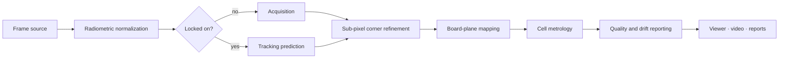

# thermal-board

Real-time metrology for heated calibration boards observed by long-wave infrared (LWIR) cameras.

The system detects a dense checkerboard of thermally controlled cells, locates every cell corner
with sub-pixel precision, and maps the results onto the board plane in physical units. It reports
the deviation of each cell from its nominal design, along with continuous feedback on
measurement precision, drift, vibration and apparent thermal expansion.

All physical parameters, including board geometry, camera, optics and tolerances, are defined in a
single configuration file. No dimensions are hard-coded.

---

## Features

- **Configuration-driven.** Board layout, camera specification, algorithm settings and accuracy
  targets are read from YAML and validated at startup.
- **Sub-pixel metrology.** Corners are located to a few hundredths of a pixel, so measurements
  are finer than the camera's ground resolution.
- **Robust acquisition.** Cells are identified by thermal polarity. This rejects false matches,
  noise and background clutter.
- **Real-time tracking.** After the first lock, the board is tracked frame to frame with
  compensation for vibration and drift, and re-acquired automatically when lost.
- **Continuous quality feedback.** Every frame gets a pass/fail verdict, per-cell deviations,
  coverage, fit quality, drift, vibration and apparent scale change.
- **CPU and GPU.** The same pipeline runs on NumPy/OpenCV or on CUDA through CuPy, with automatic
  fallback to the CPU.
- **Built-in simulator.** A physically based renderer produces radiometric sequences with exact
  ground truth, for development and validation without hardware.
- **Flexible inputs.** Synthetic feeds, video files, image folders and single radiometric frames.
- **Multiple outputs.** Live annotated viewer, recorded overlay video, console log and JSON-lines
  reports.

---

## Getting started

### Dev container (recommended)

1. Install Docker and the VS Code **Dev Containers** extension.
2. Open the project folder and choose **Reopen in Container**.

The container provides Python, zsh as the default shell, all development tools and the git
hooks. A GPU is used when the host exposes one.

### Local installation

```zsh
python3 -m venv .venv
source .venv/bin/activate
pip install -e '.[dev]'      # application, tests and quality tools
pip install -e '.[gpu]'      # optional: CUDA acceleration
pre-commit install           # optional: quality gates on every commit
```

---

## Usage

All commands use `config.yaml` from the working directory unless `--config` points elsewhere.

### Live viewer with the built-in simulator

```zsh
thermal-board run
```

Press `q` or `Esc` to close the viewer.

### Headless run with reports

```zsh
thermal-board run --headless --frames 100 --report reports.jsonl
```

### Record the annotated overlay

```zsh
thermal-board run --headless --frames 300 --record overlay.mp4
```

### Generate a synthetic recording and replay it

```zsh
thermal-board simulate --output recordings/session --frames 60
thermal-board run --source recordings/session
```

### Process recorded data

```zsh
thermal-board run --source path/to/video.mp4
thermal-board run --source path/to/frames/
thermal-board run --source path/to/frame.tiff --headless
```

16-bit radiometric images (PNG, TIFF) and NumPy arrays keep full radiometric resolution.

### Use a custom setup

```zsh
thermal-board --config path/to/setup.yaml run --source path/to/frames/
```

### Command reference

```text
thermal-board [--config PATH] run
    --source   synthetic | video file | image file | image folder   (default: synthetic)
    --frames   maximum number of frames to process
    --headless run without a window
    --record   save the annotated overlay as a video
    --report   save one JSON report per frame

thermal-board [--config PATH] simulate
    --output   destination folder
    --frames   number of frames to render
    --seed     random seed
```

`run` exits with status `0` when every processed frame meets the precision target and `1`
otherwise. That lets it act as an acceptance gate in scripts and CI.

### Python API

```python
from pathlib import Path

from thermal_board.acquisition.frame_source_factory import create_frame_source
from thermal_board.config.configuration_loader import load_configuration
from thermal_board.pipeline.pipeline_factory import build_measurement_pipeline

configuration = load_configuration(Path("config.yaml"))
pipeline = build_measurement_pipeline(configuration)

for frame in create_frame_source("synthetic", configuration).frames():
    measurement = pipeline.process(frame)
    print(measurement.report.meets_precision_target)
```

---

## Output

### Console

One line per frame:

```text
PASS frame 12 [backend] | corner rms … max … | size rms … | cells …% reproj … px
     | drift … px vibration … px | scale … ppm latency … ms
```

| Field | Description |
|---|---|
| verdict | `PASS` when the RMS error, worst-case error and per-cell tolerances are all met |
| corner / size | deviation of measured corners and cell dimensions from the nominal design |
| cells | share of cells measured successfully |
| reproj | residual of the board-to-image model, in pixels |
| drift / vibration | board motion since the first frame, and recent frame-to-frame jitter |
| scale | apparent size change since the first frame, in parts per million |
| latency | processing time per frame |

### JSON reports

Each line of a `--report` file is a complete JSON record with the same fields, including mean,
RMS and maximum statistics. It is suitable for dashboards and automated analysis.

### Viewer overlay

Cell outlines are coloured by state:

| Colour | State |
|---|---|
| green | within the precision target |
| yellow | within tolerance |
| red | out of tolerance |
| grey | not measured in this frame |

---

## Configuration

`config.yaml` is organised in sections:

| Section | Purpose |
|---|---|
| `board` | board dimensions, cell dimensions, inter-cell gap, grid size |
| `camera` | sensor type and band, resolution, frame rate, bit depth, optics, lens distortion |
| `detection` | normalization, blob filtering, matching and registration robustness |
| `refinement` | edge sampling density, estimator window, iterations and per-cell quality gates |
| `tracking` | temporal smoothing, vibration window, maximum plausible frame-to-frame motion |
| `accuracy` | precision target and hard tolerance |
| `compute` | GPU preference |
| `simulation` | radiometric levels, noise, optical blur, pose and motion of the synthetic scene |

Invalid or inconsistent configurations are rejected with a descriptive error. Examples are a
camera outside the supported specification, or a cell grid that does not fit the board.

The `refinement` settings trade throughput against worst-case precision: profiles per edge,
re-centring iterations and refinement passes.

---

## How it works



1. **Normalization.** Raw radiometric values are stretched between robust percentiles. Later
   stages then don't depend on absolute temperature or camera gain.
2. **Acquisition.** The histogram is split into cold-cell, substrate and hot-cell populations.
   Each cell becomes one blob. Blobs are matched to the board model with a polarity check, and a
   robust homography is fitted.
3. **Sub-pixel refinement.** Short intensity profiles are sampled across every cell edge. Edge
   positions come from a self-centring moment estimator, which is unbiased for symmetric optical
   blur and independent of where the edge falls within a pixel. Weighted line fits give the
   corners as edge intersections.
4. **Board-plane mapping.** A robust projective model maps all corners into physical board
   coordinates. Lens distortion is compensated when configured.
5. **Metrology.** Each cell gets its position and size deviation from the nominal design, and
   frames get aggregate statistics and a verdict.
6. **Tracking.** Later frames are predicted from the previous pose and a motion estimate. The
   board pattern is periodic, so implausible motion is rejected and triggers re-acquisition
   instead of a false lock.
7. **Monitoring.** Translation, rotation, apparent scale and vibration are tracked against the
   first frame.

---

## Development

```zsh
pre-commit run --all-files    # all quality gates
pytest                        # full test suite
pytest -m "not integration"   # fast unit tests
pytest -m integration         # full-resolution validation
```

Every commit is checked by:

- formatting and linting with all rule sets enabled;
- strict static type checking;
- house rules: short single-purpose functions, self-explanatory code without comments, and
  postponed annotations;
- file hygiene checks for YAML, TOML, JSON, whitespace and large files.

Continuous integration runs the same gates and the test suite on all supported Python versions.

### Testing

Tests describe behaviour and follow one naming template:

```text
test_when_<situation>_then_<expected behaviour>
```

- **Unit tests** run on a small synthetic board and cover each component in isolation.
- **Integration tests** render the full configured board at the full sensor resolution. They
  verify end-to-end precision against ground truth, recovery of injected deformations, tracking
  under vibration and drift, expansion reporting, and replay from disk.

---

## Limitations

- **Apparent scale is ambiguous.** From a single planar target, uniform expansion can't be told
  apart from a change in distance. Scale is reported relative to the first frame; absolute
  expansion needs an independent reference.
- **Validation is synthetic.** Precision has been verified against simulated ground truth and
  should be confirmed on recordings of a physically measured board.
- **Throughput depends on hardware.** Real-time rates at full resolution are expected from the
  GPU backend; the CPU backend runs at reduced frame rates.
- **Mounting.** Acquisition assumes a roughly upright board, as in a fixed installation.
- **The live viewer needs a display.** In headless environments, use `--headless` with
  `--record` or `--report`.
