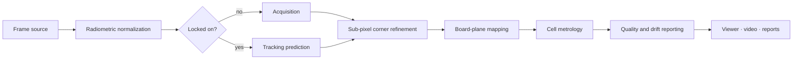

# thermal-board

Real-time metrology for heated calibration boards observed by long-wave infrared (LWIR) cameras.

The system detects a dense checkerboard of thermally controlled cells, locates every cell corner
with sub-pixel precision, and maps the results onto the board plane in physical units. It reports
the deviation of each cell from its nominal design, along with continuous feedback on
measurement precision, drift, vibration and apparent thermal expansion.

All physical parameters, including board geometry, camera, optics and tolerances, are defined in a
single configuration file. No dimensions are hard-coded.

For a deep walkthrough of the algorithms, every module and every test, see
[ARCHITECTURE.md](ARCHITECTURE.md).

---

## Features

- **Configuration-driven.** Board layout, camera specification, algorithm settings and accuracy
  targets are read from YAML and validated at startup.
- **Sub-pixel metrology.** Corners are located to a few hundredths of a pixel, so measurements
  are finer than the camera's ground resolution.
- **Robust acquisition.** Cells are identified by thermal polarity. This rejects false matches,
  noise and background clutter.
- **Real-time tracking.** After the first lock, the board is tracked frame to frame with
  compensation for vibration and drift, and re-acquired automatically when lost.
- **Continuous quality feedback.** Every frame gets a pass/fail verdict, per-cell deviations,
  coverage, fit quality, drift, vibration and apparent scale change.
- **CPU and GPU.** The same pipeline runs on NumPy/OpenCV or on CUDA through CuPy, with automatic
  fallback to the CPU.
- **Addressable cells.** Every cell has a stable number in a configurable order. Results are
  reported per cell number, and simulated gray levels can be set per cell number.
- **Embeddable service.** A UI-independent API for integrating measurement into other
  applications, with a real-time Qt example.
- **Built-in simulator.** A physically based renderer produces radiometric sequences with exact
  ground truth, for development and validation without hardware.
- **Flexible inputs.** Synthetic feeds, video files, image folders and single radiometric frames.
- **Multiple outputs.** Live annotated viewer, recorded overlay video, console log and JSON-lines
  reports.

---

## Getting started

### Dev container (recommended)

1. Install Docker and the VS Code **Dev Containers** extension.
2. Open the project folder and choose **Reopen in Container**.

The container provides Python, zsh as the default shell and everything in `requirements.txt`.
A GPU is used when the host exposes one.

The container also includes **Claude Code**: the `claude` command in the terminal and the
Claude Code extension in VS Code. Sign in once with `claude`. The login and settings live in a
Docker volume, so they survive container rebuilds.

On Linux hosts the container shares your desktop display, so the live viewer opens as a normal
window. Opening the container grants your user access to the X server
(`xhost +SI:localuser:<you>`). On macOS and Windows hosts, use `--headless` with `--record` or
`--report`.

### Local installation

```zsh
python3 -m venv .venv
source .venv/bin/activate
pip install -r requirements.txt   # application, Qt, tests and quality tools
pip install cupy-cuda12x          # optional: CUDA acceleration on NVIDIA GPUs
```

`requirements.txt` installs the project in editable mode together with every dependency.
Equivalent extras are available for partial installs: `.[dev]`, `.[qt]` and `.[gpu]`.

### VS Code tasks

Open **Terminal → Run Task** (or press `Ctrl+Shift+B` for the default build task):

| Task | What it does |
|---|---|
| Run tests | full test suite (default test task) |
| Run unit tests (fast) | unit tests only |
| Run app | live viewer on the built-in simulator (default build task) |
| Run app with cell gray levels | live viewer plus the cell gray-level window |
| Run app headless | 60 frames without a window, reports written to `reports.jsonl` |
| Run Qt example | the embedding example in a Qt window |
| Run linters | every quality check on all files |

Tasks use the Python interpreter selected in VS Code.

---

## Usage

All commands use `config.yaml` from the working directory unless `--config` points elsewhere.

### Live viewer with the built-in simulator

```zsh
thermal-board run
```

Press `q` or `Esc` to close the viewer.

### Headless run with reports

```zsh
thermal-board run --headless --frames 100 --report reports.jsonl
```

### Record the annotated overlay

```zsh
thermal-board run --headless --frames 300 --record overlay.mp4
```

### Generate a synthetic recording and replay it

```zsh
thermal-board simulate --output recordings/session --frames 60
thermal-board run --source recordings/session
```

### Process recorded data

```zsh
thermal-board run --source path/to/video.mp4
thermal-board run --source path/to/frames/
thermal-board run --source path/to/frame.tiff --headless
```

16-bit radiometric images (PNG, TIFF) and NumPy arrays keep full radiometric resolution.

### Use a custom setup

```zsh
thermal-board --config path/to/setup.yaml run --source path/to/frames/
```

### Command reference

```text
thermal-board [--config PATH] run
    --source   synthetic | video file | image file | image folder   (default: synthetic)
    --frames   maximum number of frames to process
    --headless run without a window
    --record   save the annotated overlay as a video
    --report   save one JSON report per frame
    --levels   also open the cell gray-level window

thermal-board [--config PATH] simulate
    --output       destination folder
    --frames       number of frames to render
    --seed         random seed
    --cell-levels  CSV of per-cell gray levels (see "Cell numbering and gray levels")

thermal-board [--config PATH] cells
    --output   CSV file listing every cell number with its row, column and position
```

`run` exits with status `0` when every processed frame meets the precision target and `1`
otherwise. That lets it act as an acceptance gate in scripts and CI.

### Python API

```python
from pathlib import Path

from thermal_board.acquisition.frame_source_factory import create_frame_source
from thermal_board.service import BoardMetrologyService

service = BoardMetrologyService.from_configuration_file(Path("config.yaml"))

for frame in create_frame_source("synthetic", service.configuration).frames():
    measurement = service.measure(frame.pixels, frame.timestamp_s)
    if measurement is None:
        continue  # board not visible in this frame
    print(measurement.report.meets_precision_target)
```

See [Embedding in another application](#embedding-in-another-application) for the full API.

---

## Output

### Console

One line per frame:

```text
PASS frame 12 [backend] | corner rms … max … | size rms … | cells …% reproj … px
     | drift … px vibration … px | scale … ppm latency … ms
```

| Field | Description |
|---|---|
| verdict | `PASS` when the RMS error, worst-case error and per-cell tolerances are all met |
| corner / size | deviation of measured corners and cell dimensions from the nominal design |
| cells | share of cells measured successfully |
| reproj | residual of the board-to-image model, in pixels |
| drift / vibration | board motion since the first frame, and recent frame-to-frame jitter |
| scale | apparent size change since the first frame, in parts per million |
| latency | processing time per frame |

### JSON reports

Each line of a `--report` file is a complete JSON record with the same fields, including mean,
RMS and maximum statistics. It is suitable for dashboards and automated analysis.

### Viewer

The viewer shows the camera image on the left and an information panel on the right.

- **Camera view.** The thermal image in white-hot grayscale. Cells that need attention are
  outlined, and the worst cell is ringed and labelled with its cell number.
- **Status badge.** `PASS` or `FAIL` for the current frame, or `LOST` when no board is visible.
- **Metrics.** Accuracy, coverage, motion and system performance.
- **Deviation map.** Every cell in board layout, coloured from zero error to the configured
  tolerance, with a colour bar.
- **Worst cell.** The number and error of the cell furthest from its nominal position.

| Outline colour | Cell state |
|---|---|
| none | within the precision target |
| yellow | within tolerance |
| red | out of tolerance |
| grey | not measured in this frame |

### Cell gray-level window

```zsh
thermal-board run --levels
```

This opens an optional second window showing the measured gray level of every cell, in board
layout, shaded from the lowest to the highest level in the frame.

- **Hover** any cell to read its number, gray level, row and column.
- **Small boards** also print each cell's number and level inside the cell.
- **Unmeasured cells** are drawn in a distinct colour.

---

## Cell numbering and gray levels

Every cell has a number from `0` to `cells − 1`. By default, numbering starts at the top-right
cell and runs **right to left** along each row, then continues on the next row down. Both
directions are configurable:

```yaml
board:
  numbering_rows: top_to_bottom       # or bottom_to_top
  numbering_columns: right_to_left    # or left_to_right
```

Directions are as seen by the camera. All per-cell results are arrays indexed by this number, so
`measurement.cells.center_deviation_mm[n]` is the deviation of cell `n`.

### Export the numbering map

```zsh
thermal-board cells --output cells.csv
```

```text
cell,row,column,center_x_mm,center_y_mm,level
0,0,<last column>,…,…,…
1,0,<last column − 1>,…,…,…
```

Use this table to map cell numbers to heater channels in your controller.

### Set gray levels per cell

Write a CSV of `cell,level` rows. Only listed cells change; all others keep the default
checkerboard levels:

```text
cell,level
0,10500
1,6200
57,9800
```

```zsh
thermal-board simulate --output recordings/pattern --frames 30 --cell-levels levels.csv
thermal-board run --source recordings/pattern
```

From Python, pass a full array indexed by cell number:

```python
from thermal_board.geometry.board_model import BoardModel
from thermal_board.simulation.synthetic_sequence import SequencePlan, SyntheticSequenceSource
from thermal_board.simulation.thermal_board_renderer import CellPattern, checkerboard_levels

model = BoardModel(configuration.board)
levels = checkerboard_levels(model, configuration.simulation)
levels[42] = 11000.0
plan = SequencePlan(
    frame_count=30, vibration_amplitude_px=0.0, cell_pattern=CellPattern(levels=levels)
)
source = SyntheticSequenceSource(configuration, plan)
```

### Read back measured gray levels

Every measurement reports the mean radiometric level inside each cell, by cell number:

```python
measured = measurement.cells.measured_levels  # array, one value per cell number
print(measured[42])
```

This closes the loop: command a level on the hardware, then verify what the camera sees for
that exact cell.

> **Detection needs contrast.** Each cell must be clearly hotter or colder than the substrate
> between cells. With the default checkerboard, hot and cold cells must also alternate. If you
> drive other patterns, set `detection.require_checkerboard_polarity: false`.

---

## Embedding in another application

The measurement engine is independent of the bundled viewer, so you can use it as a service
inside a larger system with its own UI.

### Service API

```python
from thermal_board.service import BoardMetrologyService

service = BoardMetrologyService.from_configuration_file(path)  # once, at start-up

measurement = service.measure(pixels, timestamp_s)  # per frame; pixels = 2-D array from your camera
if measurement is None:  # board not visible
    canvas = service.annotate_lost(pixels)
else:
    canvas = service.annotate(measurement)  # optional ready-made overlay (BGR image)
```

| Data | Meaning |
|---|---|
| `measurement.report` | frame verdict and statistics (the same fields as the JSON report) |
| `measurement.cells.center_deviation_mm[n]` | x/y deviation of cell `n` from its nominal position |
| `measurement.cells.widths_mm[n]`, `heights_mm[n]` | measured size of cell `n` |
| `measurement.cells.measured_levels[n]` | measured gray level of cell `n` |
| `measurement.cells.valid[n]` | whether cell `n` was measured in this frame |
| `measurement.localization.refined.corners_px[n]` | the four image corners of cell `n`, for your own drawing |
| `service.cell_count` | number of cells |
| `service.render_level_map(measurement, hovered_cell)` | the cell gray-level map as an image |
| `service.cell_at_level_map(x, y)` | the cell number under a pixel of that map, for hover handling |

`measure` is synchronous and holds tracking state between frames. Use one service instance per
camera stream, and call it from one thread.

### Real-time Qt integration

A complete PySide6 example is in [examples/qt_stream_viewer.py](examples/qt_stream_viewer.py):

```zsh
pip install -e '.[qt]'
python examples/qt_stream_viewer.py                           # simulated stream
python examples/qt_stream_viewer.py --source path/to/video.mp4
```

The pattern for a real-time stream:

1. **Measure on a worker thread.** Run `service.measure` in a `QObject` moved to a `QThread`, so
   the UI stays responsive. Feed it frames from your camera callback or queue.
2. **Send results with a signal.** Emit the measurement, or a rendered image, through a `Signal`.
   Qt delivers it to the GUI thread.
3. **Draw on the GUI thread.** Convert to a `QImage`/`QPixmap` and show it in your own widget,
   or draw your own overlay from `corners_px` and the per-cell results.
4. **Handle completion on the GUI thread.** Connect worker signals to `@Slot` methods of a GUI
   object, never to plain callables, so shutdown runs on the correct thread.
5. **Drop frames when busy.** If processing is slower than the camera, keep only the newest
   frame instead of queueing, so latency stays bounded.

To replace the example's file or simulator source with your camera, call `service.measure` from
the place where your application receives frames. Nothing else changes.

---

## Configuration

`config.yaml` is organised in sections:

| Section | Purpose |
|---|---|
| `board` | board dimensions, cell dimensions, inter-cell gap, grid size |
| `camera` | sensor type and band, resolution, frame rate, bit depth, optics, lens distortion |
| `detection` | normalization, blob filtering, matching and registration robustness |
| `refinement` | edge sampling density, estimator window, iterations and per-cell quality gates |
| `tracking` | temporal smoothing, vibration window, maximum plausible frame-to-frame motion |
| `accuracy` | precision target and hard tolerance |
| `compute` | GPU preference |
| `simulation` | radiometric levels, noise, optical blur, pose and motion of the synthetic scene |

Invalid or inconsistent configurations are rejected with a descriptive error. Examples are a
camera outside the supported specification, or a cell grid that does not fit the board.

The `refinement` settings trade throughput against worst-case precision: profiles per edge,
re-centring iterations and refinement passes.

---

## How it works



1. **Normalization.** Raw radiometric values are stretched between robust percentiles. Later
   stages then don't depend on absolute temperature or camera gain.
2. **Acquisition.** The histogram is split into cold-cell, substrate and hot-cell populations.
   Each cell becomes one blob. Blobs are matched to the board model with a polarity check, and a
   robust homography is fitted.
3. **Sub-pixel refinement.** Short intensity profiles are sampled across every cell edge. Edge
   positions come from a self-centring moment estimator, which is unbiased for symmetric optical
   blur and independent of where the edge falls within a pixel. Weighted line fits give the
   corners as edge intersections.
4. **Board-plane mapping.** A robust projective model maps all corners into physical board
   coordinates. Lens distortion is compensated when configured.
5. **Metrology.** Each cell gets its position and size deviation from the nominal design, and
   frames get aggregate statistics and a verdict.
6. **Tracking.** Later frames are predicted from the previous pose and a motion estimate. The
   board pattern is periodic, so implausible motion is rejected and triggers re-acquisition
   instead of a false lock.
7. **Monitoring.** Translation, rotation, apparent scale and vibration are tracked against the
   first frame.

---

## Development

```zsh
pre-commit run --all-files    # all quality checks (the "Run linters" task)
pytest                        # full test suite
pytest -m "not integration"   # fast unit tests
pytest -m integration         # full-resolution validation
```

Quality checks run on demand; nothing is installed as a git hook. They cover:

- formatting and linting with all rule sets enabled;
- strict static type checking;
- house rules: short single-purpose functions, self-explanatory code without comments, and
  postponed annotations;
- file hygiene checks for YAML, TOML, JSON, whitespace and large files.

Continuous integration runs the same checks and the test suite on all supported Python versions.

### Testing

Tests describe behaviour and follow one naming template:

```text
test_when_<situation>_then_<expected behaviour>
```

- **Unit tests** run on a small synthetic board and cover each component in isolation.
- **Integration tests** render the full configured board at the full sensor resolution. They
  verify end-to-end precision against ground truth, recovery of injected deformations, tracking
  under vibration and drift, expansion reporting, and replay from disk.

---

## Limitations

- **Apparent scale is ambiguous.** From a single planar target, uniform expansion can't be told
  apart from a change in distance. Scale is reported relative to the first frame; absolute
  expansion needs an independent reference.
- **Validation is synthetic.** Precision has been verified against simulated ground truth and
  should be confirmed on recordings of a physically measured board.
- **Throughput depends on hardware.** Real-time rates at full resolution are expected from the
  GPU backend; the CPU backend runs at reduced frame rates.
- **Mounting.** Acquisition assumes a roughly upright board, as in a fixed installation.
- **The live viewer needs a display.** It works locally and in the dev container on Linux. On
  servers and other headless environments, use `--headless` with `--record` or `--report`.
